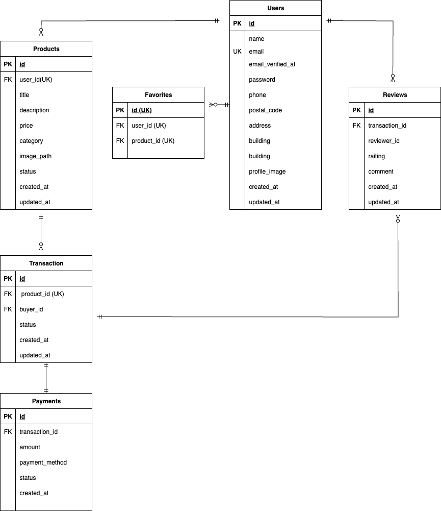

# coachtech-freemarket

・COACHTECHフリマ（フリマアプリ）
ユーザー登録すると商品を出品できるようになるフリマアプリです。
Laravel 10 ＋　Fortify を使用し、Docker環境で動作します。

・使用技術
- PHP 8.2
- Laravel 10
- Laravel Fortify
- MySQL 8.0
- Nginx
- phpAdmin
- Docker / Docker Compose

・環境構築手順
1. git clone git@github.com:ユーザー名/coachtech-freemarket.git
- cd coachtech-freemarket

2. Laravelプロジェクト作成
- composer create-project laravel/laravel="10.*" src

3. 環境変数設定
- cp src/.env.example src/.env
- .env 修正
DB_CONNECTION=mysql
DB_HOST=mysql
DB_PORT=3306
DB_DATABASE=laravel_db
DB_USERNAME=laravel_user
DB_PASSWORD=laravel_pass

4. MySQLのイメージをARM64対応版に変更
- docker-compose.yml の mysql サービスに以下を追加
- platform: linux/amd64

5. Dockerコンテナ起動
- docker compose up -d --build

6. アプリキー生成
- docker compose exec php bash
- cd src
- php artisan key:generate

7. LaravelFortifyインストール
- composer require laravel/fortify

8. FortifyServiceProvider作成
- php artisan make:provider FortifyServiceProvider
作成後、config/app.php の providers に以下追記
- App\Providers\FortifyServiceProvider::class,

9. マイグレーション実行
- php artisan migrate

----

・エラーと解決方法

1. Class "App\Providers\FortifyServiceProvider" not found
原因: config/app.php に FortifyServiceProvider を追記しているのに
ファイルが存在しない状態で artisan コマンドを実行していた
解決:
	1.	config/app.php の追記を一旦コメントアウト
	2.	php artisan make:provider FortifyServiceProvider
	3.	ファイル生成後に config/app.php へ再追加

2. Your Composer dependencies require a PHP version ">= 8.2.0". You are running 8.1.33
原因：PHPバージョンエラー
解決：Dockerfile を PHP 8.2 に修正
FROM php:8.2-fpm
再ビルド：
docker compose build --no-cache
docker compose up -d

