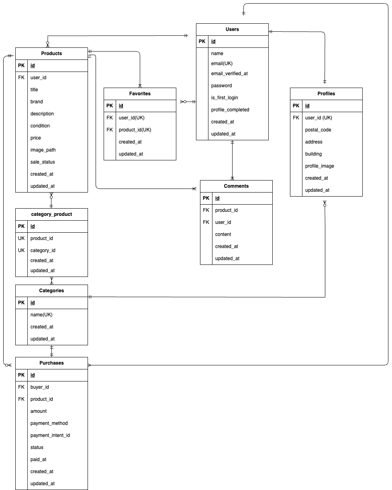

# coachtech-freemarket

・COACHTECH フリマ（フリマアプリ）
ユーザー登録すると商品を出品できるようになるフリマアプリです。
検索 UI/ロジックを共通化して、商品一覧とマイリスト（お気に入り）で同じ操作感を実現。
Laravel 10 ＋　 Fortify を使用し、Docker 環境で動作します。

• Web: http://localhost:8081
• phpMyAdmin: http://localhost:8080

・使用技術

- PHP 8.2
- Laravel 10
- Laravel Fortify
- MySQL 8.0
- Nginx
- phpAdmin
- Docker / Docker Compose

・環境構築手順

1. git clone git@github.com:ユーザー名/coachtech-freemarket.git

- cd coachtech-freemarket

2. Laravel プロジェクト作成

- composer create-project laravel/laravel="10.\*" src

3. 環境変数設定

- cp src/.env.example src/.env
- .env 修正
  DB_CONNECTION=mysql
  DB_HOST=mysql
  DB_PORT=3306
  DB_DATABASE=laravel_db
  DB_USERNAME=laravel_user
  DB_PASSWORD=laravel_pass

4. MySQL のイメージを ARM64 対応版に変更

- docker-compose.yml の mysql サービスに以下を追加
- platform: linux/amd64

5. Docker コンテナ起動

- docker compose up -d --build

6. アプリキー生成

- docker compose exec php bash
- cd src
- php artisan key:generate

7. php artisan storage:link

8. LaravelFortify インストール

- composer require laravel/fortify

9. FortifyServiceProvider 作成

- php artisan make:provider FortifyServiceProvider
  作成後、config/app.php の providers に以下追記
- App\Providers\FortifyServiceProvider::class,

10. マイグレーション実行

- php artisan migrate

---

・メール認証の確認方法

Mailtrap の利用
•本番メールサーバーの代わりに Mailtrap を使用。

- .env 設定:
  MAIL_MAILER=smtp
  MAIL_HOST=sandbox.smtp.mailtrap.io
  MAIL_PORT=2525
  MAIL_USERNAME=xxxxx
  MAIL_PASSWORD=xxxxx
  MAIL_ENCRYPTION=null
  MAIL_FROM_ADDRESS=no-reply@example.com
  MAIL_FROM_NAME="Freemarket"

手順 1. 新規会員登録を行う。 2. Mailtrap の Inbox に送信された認証メールを確認。 3. メール内の認証リンクをクリック。 4. 初回ログイン時はプロフィール登録画面に遷移、その後は items 一覧に遷移。

ユーザーの状態管理用カラム
|カラム名　　　　　　|説明
|------------------|---------------------------------------------------
|is_first_login 　　|初回ログイン時にプロフィール入力するへ誘導するためのフラグ。登録時は自動的に 1(true)になる。初回プロフィール保存時に０へ
|profile_completed |プロフィールが設定済みかを判定するためのカラム。登録時には自動的に 0(false)となりプロフィール設定完了後に 1(true)へ更新される
・laravel のマイグレーションで'default' 値を指定することで、登録時に自動的に値が入るように設計しています。

---

・購入フロー：詳細 -> 確認（支払い方法プルダウン） -> Stripe -> 完了
・支払い方法：UI でカード/コンビニを選択可能
・成功時の処理：products.sale_status = 'sold',purchase にレコード作成
・SOLD 表示：一覧でバッジ、詳細で購入ボタン向こう
・購入履歴：/profile/purchases に表示

・Stripe 決済機能について
概要：

- 商品ページから購入確認ページを経由し、Stripe の Checkout ページで決済を行うことができます。

- テストカード番号
  |　カードブランド　　　　カード番号　　　　　有効期限　　　　　　 CVC 　　　　　　　備考
  |-----------------|---------------------|------------|-------------|-----------------|
  　　　 VISA 4242 4242 4242 4242 任意の未来日　　任意の 3 桁　　　　常に成功する決済

・環境変数設定(.env)
STRIPE_KEY=pk_test_xxxxxxxxxxxxxxxxxxxxx
STRIPE_SECRET=sk_test_xxxxxxxxxxxxxxxxxxxxx

---

