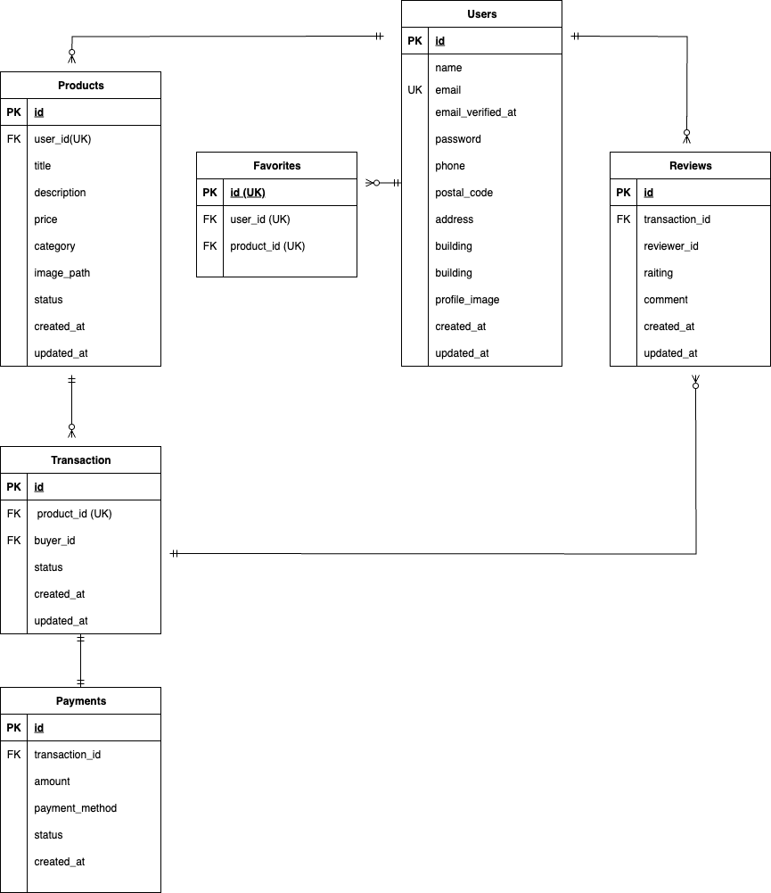

# coachtech-freemarket

・COACHTECH フリマ（フリマアプリ）
ユーザー登録すると商品を出品できるようになるフリマアプリです。
Laravel 10 ＋　 Fortify を使用し、Docker 環境で動作します。

・使用技術

- PHP 8.2
- Laravel 10
- Laravel Fortify
- MySQL 8.0
- Nginx
- phpAdmin
- Docker / Docker Compose

・環境構築手順

1. git clone git@github.com:ユーザー名/coachtech-freemarket.git

- cd coachtech-freemarket

2. Laravel プロジェクト作成

- composer create-project laravel/laravel="10.\*" src

3. 環境変数設定

- cp src/.env.example src/.env
- .env 修正
  DB_CONNECTION=mysql
  DB_HOST=mysql
  DB_PORT=3306
  DB_DATABASE=laravel_db
  DB_USERNAME=laravel_user
  DB_PASSWORD=laravel_pass

4. MySQL のイメージを ARM64 対応版に変更

- docker-compose.yml の mysql サービスに以下を追加
- platform: linux/amd64

5. Docker コンテナ起動

- docker compose up -d --build

6. アプリキー生成

- docker compose exec php bash
- cd src
- php artisan key:generate

7. LaravelFortify インストール

- composer require laravel/fortify

8. FortifyServiceProvider 作成

- php artisan make:provider FortifyServiceProvider
  作成後、config/app.php の providers に以下追記
- App\Providers\FortifyServiceProvider::class,

9. マイグレーション実行

- php artisan migrate



---

・メール認証の確認方法

Mailtrap の利用
•本番メールサーバーの代わりに Mailtrap を使用。

- .env 設定:
  MAIL_MAILER=smtp
  MAIL_HOST=sandbox.smtp.mailtrap.io
  MAIL_PORT=2525
  MAIL_USERNAME=xxxxx
  MAIL_PASSWORD=xxxxx
  MAIL_ENCRYPTION=null
  MAIL_FROM_ADDRESS=no-reply@example.com
  MAIL_FROM_NAME="Freemarket"

手順 1. 新規会員登録を行う。 2. Mailtrap の Inbox に送信された認証メールを確認。 3. メール内の認証リンクをクリック。 4. 初回ログイン時はプロフィール登録画面に遷移、その後は items 一覧に遷移。

ユーザーの状態管理用カラム
|カラム名　　　　　　|説明
|------------------|---------------------------------------------------
|is_first_login 　　|初回ログイン時にプロフィール入力するへ誘導するためのフラグ。登録時は自動的に 1(true)になる。初回プロフィール保存時に０へ
|profile_completed |プロフィールが設定済みかを判定するためのカラム。登録時には自動的に 0(false)となりプロフィール設定完了後に 1(true)へ更新される
・laravel のマイグレーションで'default' 値を指定することで、登録時に自動的に値が入るように設計しています。

---

・購入フロー：詳細 -> 確認（支払い方法プルダウン） -> Stripe -> 完了
・支払い方法：UI でカード/コンビニを選択可能
・成功時の処理：products.sale_status = 'sold',purchase にレコード作成
・SOLD 表示：一覧でバッジ、詳細で購入ボタン向こう
・購入履歴：/profile/purchases に表示

・Stripe 決済機能について
概要：

- 商品ページから購入確認ページを経由し、Stripe の Checkout ページで決済を行うことができます。

- テストカード番号
  |　カードブランド　　　　カード番号　　　　　有効期限　　　　　　 CVC 　　　　　　　備考
  |-----------------|---------------------|------------|-------------|-----------------|
  　　　 VISA 4242 4242 4242 4242 任意の未来日　　任意の 3 桁　　　　常に成功する決済

・環境変数設定(.env)
STRIPE_KEY=pk_test_xxxxxxxxxxxxxxxxxxxxx
STRIPE_SECRET=sk_test_xxxxxxxxxxxxxxxxxxxxx

---

・画像アップロード対応（プロフィール画像）
(ユーザーがアップロードするファイルは storage/app/public に保存されます)
１）追加パッケージ

```
composer require intervention/image:^3 intervention/image-laravel:^1
php artisan optimize:clear

２）Dockerfileの変更（php-fpm）
- GD + JPEG/FreeType を有効化して WebP を扱えるようにします。
```

FROM php:8.2-fpm

COPY php.ini /usr/local/etc/php/

RUN apt-get update && apt-get install -y \
 libpng-dev libjpeg62-turbo-dev libfreetype6-dev \
 && docker-php-ext-configure gd --with-freetype --with-jpeg \
 && docker-php-ext-install -j$(nproc) gd \
 && rm -rf /var/lib/apt/lists/\*

WORKDIR /var/www

- 反映コマンド

```
docker compose build --no-cache php
docker compose up -d
- 動作確認
docker compose exec php php -m | grep -Ei 'gd|exif'
docker compose exec php php -i | grep -i webp
- gd / exif が出る、WebP Support => enabled が出る

３）php.iniの変更
- アップロードサイズを拡張
以下追記
```

upload_max_filesize = 20M
post_max_size = 21M

４）Nginx のクライアントサイズ制限

- nginx/default.conf に以下追記

```
client_max_body_size 20M;

５）laravel側の設定
- ストレージ公開
php artisan storage:link

- public ディスクを使用（Storage::disk('public')）

----

・エラーと解決方法

1. Class "App\Providers\FortifyServiceProvider" not found
   原因: config/app.php に FortifyServiceProvider を追記しているのに
   ファイルが存在しない状態で artisan コマンドを実行していた
   解決: 1. config/app.php の追記を一旦コメントアウト 2. php artisan make:provider FortifyServiceProvider 3. ファイル生成後に config/app.php へ再追加

2. Your Composer dependencies require a PHP version ">= 8.2.0". You are running 8.1.33
   原因：PHP バージョンエラー
   解決：Dockerfile を PHP 8.2 に修正
   FROM php:8.2-fpm
   再ビルド：
   docker compose build --no-cache
   docker compose up -d

---

・エラーと解決方法

1.419 エラー(Page Expired)
・ログインフォーム送信時に発生
・メッセージ：419 Page Expired

2.404 エラー
・ログイン成功後に/home にリダイレクトされるが、そのルートが存在しないため発生
・メッセージ：NotFound

原因： .env が http://localhost のまま、アクセスは http://localhost:8081
・Laravel Fortify がデフォルトで /home にリダイレクト
・今回のアプリには /home ルートが無いため 404

419 エラー解決方法：.env を以下に修正

- APP_URL=http://localhost:8081
  修正後にキャッシュクリア
- docker compose exec php php artisan config:clear
- docker compose exec php php artisan cache:clear
- docker compose exec php php artisan route:clear

404 エラー解決方法：

- LoginResponse をオーバーライドしてログイン後 /items にリダイレクトする。
  ファイル作成：src/app/Http/Responses/LoginResponse.php

```

<?php

namespace App\Http\Responses;

use Laravel\Fortify\Contracts\LoginResponse as LoginResponseContract;

class LoginResponse implements LoginResponseContract
{
    public function toResponse($request)
    {
        return redirect()->intended('/items');
    }
}
```

- サービスプロバイダに登録
  src/app/Providers/AppServiceProvider.php

```
use Laravel\Fortify\Contracts\LoginResponse;
use App\Http\Responses\LoginResponse as CustomLoginResponse;

public function register()
{
    $this->app->singleton(LoginResponse::class, CustomLoginResponse::class);
}
```

---

・エラーと解決方法 1.プロフィール初回登録画面に遷移しない問題

- 原因: `is_first_login` フラグが更新されない。
- 対応:
  - `LoginResponse.php` を修正し、`is_first_login` が true の場合に `profile.create` に遷移。
  - `ProfileController@store` でプロフィール保存後に `is_first_login` を false に更新。
  - 修正後に `php artisan optimize:clear` を実行しキャッシュをクリア。

````php
// ProfileController@store
$request->user()->update(['is_first_login' => false]);

2. メール認証後に items へ遷移する問題
- 原因: Fortify のメール認証処理に初回ログイン判定が組み込まれていなかった。
- 対応:
- web.php のメール認証ルートに is_first_login 判定を追加。
```php
Route::get('/email/verify/{id}/{hash}', function (EmailVerificationRequest $request) {
    $request->fulfill();

    if ($request->user()->is_first_login) {
        return redirect()->route('profile.create');
    }
    return redirect()->route('items.index');
})->middleware(['auth', 'signed'])->name('verification.verify');
````

---
